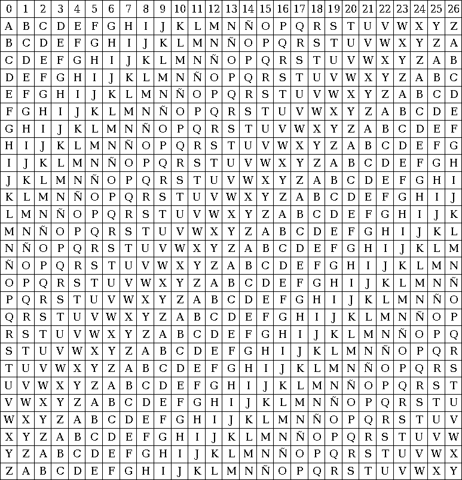
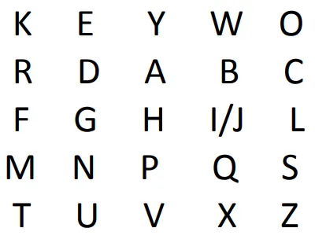
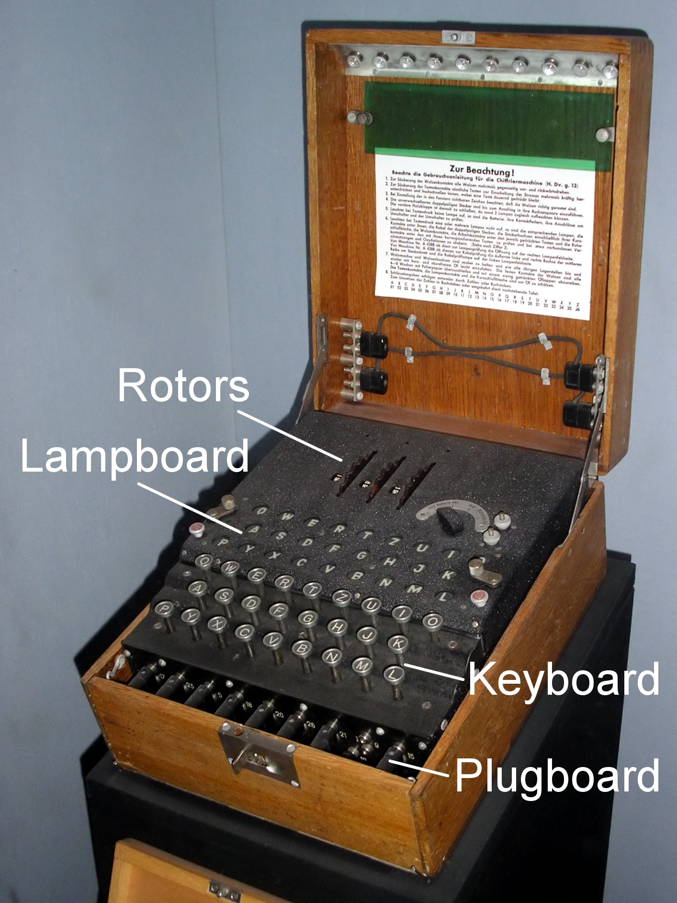

# Investigacion

## Cifrado Vigenère

El cifrado de Vigenère es un método clásico de cifrado por sustitución polialfabética: en lugar de usar una única sustitución para todo el mensaje, combina múltiples desplazamientos tipo César basados en un palabra clave.

Para esto se usa una palabra secreta que se repite hasta alcanzar la misma longitud que el mensaje que quieres cifrar. Hay dos posibilidades para esto, tener una palabra lo suficientemente larga o repetir la palabra varias veces.

Para la encriptacion o desencriptacion se usa una tabla de 26×26 letras donde cada fila representa una versión del alfabeto desplazada (la primera fila es A-Z, la siguiente B-Z A, luego C-Z A B, y así sucesivamente).

#### Como funciona el difrado paso a paso

1. Repite la clave hasta que tenga la longitud del mensaje.
    
    Por ejemplo, si la clave es LEMON y el mensaje es ATTACKATDAWN, la clave repetida sería LEMONLEMONLE.

2. Para cada letra del texto:

    * Localiza la columna del plaintext en la Tabula Recta.
    * Selecciona la fila correspondiente a la letra de la clave.
    * El cruce fila × columna te da la letra cifrada.

Este proceso hace que el mismo caracter en texto puede codificarse de diferente manera

### ¿Por qué protege mejor que un cifrado simple?

Los cifrados monoalfabéticos (como César) siempre sustituyen cada letra por otra de acuerdo con un solo patrón de desplazamiento, por lo que las letras más frecuentes en el texto original permanecen relativamente frecuentes en el cifrado. Esto permite el análisis de frecuencia para casi “adivinar” qué letra corresponde a cada una.

Con Vigenère cada posición utiliza un desplazamiento diferente, basado en la clave. Esto distribuye la frecuencia de las letras en el cifrado, de modo que no se refleja directamente la frecuencia original del idioma.

### Rompiendo el Vigenère (kasiski)

Aunque Vigenère mejora la seguridad respecto a cifrados simples, tiene una debilidad: la clave se repite.

El Examen de Kasiski se basa en buscar secuencias repetidas en el texto cifrado. Estos pasos son típicos:

1. Localizar secuencias repetidas en el cifrado (por ejemplo, grupos de 3 o más letras que se repiten).

2. Medir la distancia entre ocurrencias de la misma secuencia.

3. Encontrar los factores comunes de estas distancias.

Ejemplo: si la secuencia “VTW” aparece dos veces separadas por 18 letras, esto sugiere que la longitud de la clave podría ser 3, 6 o 9 (divisores de 18).

## Hill Cipher (Cifrado Hill)

En criptografía clásica, el Cifrado Hill es un cifrado de sustitución poligráfica basado en el álgebra lineal. Inventado por Lester S. Hill en 1929, fue el primer cifrado poligráfico que era práctico para operar sobre más de tres símbolos inmediatamente.

### Base matematica

* __Representacion de letras__

    Antes de cifrar, se convierte cada letra a un número según una correspondencia fija (comúnmente: A = 0, B = 1, …, Z = 25 ), y se hace aritmética modular (usualmente módulo 26).

* __Bloques y vectores__

    * El texto plano se divide en bloques de tamaño n (por ejemplo, 2 o 3 letras).

    * Cada bloque se transforma en un vector columna de tamaño n×1.

* __Bloques y vectores__

    Se elige una matriz clave K de tamaño n×n y se calcula: *C=K×P mod26*

    donde:

    * P: es el vector del texto plano
    * C: es el vector del texto cifrado
    * La multiplicación y el módulo 26 mantienen los resultados en la gama de 0–25.

### Requisitos matemáticos de la matriz clave

Para que el cifrado funcione y pueda descifrarse, la matriz clave debe cumplir condiciones muy importantes:

1. Debe ser una matriz cuadrada (n×n)
2. Debe ser invertible módulo 26. Esto significa que existe una matriz K^-1 tal que:

    $$x = {K^{-1}  \times  K  \equiv I  mod (26)}$$

    donde I es la matriz identidad.
3. El determinante de la matriz debe ser coprimo con 26, el determinante no puede ser 0 o modulo 26. El maximo comun divisor entre det(K) y 26 debe ser 1

## Playfair Cipher

El cifrado de Playfair es un método manual de criptografía simétrica por medio de sustitución. El sistema de cifrado toma pares de letras, o digramas, y las cambia mediante una tabla generada por una clave.​ Utiliza una matriz de 5 X 5 generada por una palabra clave para cifrar, lo que ofrece mayor seguridad que los métodos de sustitución simple.

### Proceso de creacion

El cifrado de Playfair usa un cuadro de 5×5 letras (una variante del Cuadrado de Polibio) que sirve como clave visual para cifrar mensajes. Para construirlo.

1. Escoge una palabra clave y elimina cualquier letra repetida.
2. Escribe esa palabra clave en una tabla de 5 filas × 5 columnas, de izquierda a derecha y de arriba hacia abajo.
3. Completa el resto de los espacios con las letras restantes del alfabeto en orden, omitiendo una letra (comúnmente “J” se combina con “I” o se omite) para que haya exactamente 25 letras

Ejemplo: Tenemos la palabra clave "KEYWORD" y la ponemos en la matriz

Antes de cifrar, el texto original se divide en pares secuenciales de letras, llamados digráfos. Si dos letras en un par son iguales, se inserta un carácter de relleno (como “X”) entre ellas; si hay una letra final sin pareja, también se rellena con “X” o similar.

Para cada digrafo, se aplican las siguientes reglas:

1.  Misma fila: Reemplaza cada letra por la que está inmediatamente a su derecha (envolviendo al principio si hace falta).
2.  Misma columna: Reemplaza cada letra por la que está justo debajo (envolviendo hacia arriba si hace falta).
3.  Diferente fila y columna: Forma un rectángulo con las dos letras como esquinas opuestas, y reemplaza cada letra por la de la misma fila pero en la columna de la otra letra.
4.  Letras repetidas en par: Inserta una letra de relleno para evitar duplicados y vuelve a aplicar las reglas anteriores.

Este proceso convierte cada par de letras en otro par según posiciones relativas en la cuadrícula. Para descifrar se aplican reglas inversas (mismas filas → izquierda, mism as columnas → encima, mismo rectángulo → opuesto).

### Contexto historico

Aunque el Playfair fue inventado en 1854 por Charles Wheatstone, recibió su nombre por Lord Playfair, quien promovió su uso.

El cifrado Playfair fue utilizado por fuerzas británicas con fines tácticos en conflictos como la Segunda Guerra de los Bóers y la Primera Guerra Mundial y también por los australianos y otras fuerzas aliadas en la Segunda Guerra Mundial porque era relativamente rápido de usar y no necesitaba equipo especial, bastaba con un lápiz, papel y una clave memorizada para cifrar y descifrar mensajes. Un escenario típico de uso era proteger secretos importantes pero no críticos durante el combate; debido a que el cifrado hacia más difícil el análisis de frecuencia simple al operar sobre pares de letras, requería mayor tiempo y cantidad de texto para ser roto, y como la información táctica suele perder relevancia rápidamente, para cuando un criptoanalista enemigo pudiera descifrarlo, la información ya no era útil, haciéndolo práctico para comunicaciones urgentes en el campo sin requerir dispositivos complejos.

## Enigma Machine

La máquina Enigma fue un dispositivo electromecánico de rotores utilizado por Alemania para cifrar comunicaciones militares durante la Segunda Guerra Mundial, famoso por sus > 150 billones de combinaciones posibles. Inventada por Arthur Scherbius en 1918, su alto nivel de encriptación parecía inquebrantable, pero fue descifrada por aliados liderados por Alan Turing en Bletchley Park, acortando la guerra.

### Logica de los rotores y susticion dinamica

La clave principal de la Enigma era su serie de rotores (o ruedas) que implementaban sustituciones eléctricas entre letras. Cada rotor tiene 26 contactos en cada cara representando las letras A–Z, con circuitos internos fijos que conectan una entrada con una salida de manera aparentemente aleatoria.

Cuando se preciona una tecla La corriente eléctrica entra a través del teclado y pasa primero por la plugboard (más abajo). Luego el pulso va al primer rotor en el conjunto, sigue por los siguientes rotores (usualmente tres en máquinas militares) y llega al reflector.

La innovación fue que cada vez que se presiona una tecla, al menos un rotor avanza una posición, alterando la conexión interna y cambiando así la sustitución que se aplica a cada letra. Como resultado, la “alfabeto de sustitución” cambia continuamente con cada letra cifrada, haciendo que incluso letras iguales producidas en momentos distintos se codifiquen de maneras totalmente diferentes.

### Reflector

El reflector es una parte fija que devuelve la señal a través de los rotores por una ruta distinta, permitiendo que la máquina use la misma configuración para cifrar y descifrar.

* El reflector está cableado con pares de letras que intercambian señales (por ejemplo, A ↔ H, B ↔ T), y estas conexiones son fijas y no cambiables por el operador.

* Cuando la señal alcanza el reflector, no hay retroceso por el mismo camino, sino por uno diferente en sentido inverso por los rotores.

Este diseño hace que ninguna letra pueda cifrarse como ella misma (es decir, A jamás se transforma en A). Esa propiedad, conocida como derangement, fue útil para los criptoanalistas aliados, ya que les permitió eliminar posibilidades al buscar patrones en mensajes cifrados.

### Plugboard

La plugboard era un panel frontal con 26 zócalos para letras donde se podían conectar cables para intercambiar pares de letras antes y después de que la señal pasara por los rotores.

Por ejemplo: si conectas E con Q, entonces cada vez que se presione una E, la señal entra al sistema como Q, y viceversa.

No todos los cables tenían que ser usados — eran posibles entre 0 y 13 pares; normalmente se usaban 10.

Aunque la plugboard por sí misma solo hace un simple intercambio de letras, cuando se combina con los rotores y el reflector, exponencialmente incrementa el número de posibles configuraciones de toda la máquina.

---
Entre seleccion y orden de los rotores, la posicion inicial de cada rotor y la configuracion de cables en el plugboard.

El espacio de claves se volvió enorme, y los ajustes diarios eran la clave de seguridad para las comunicaciones alemanas durante la guerra.

---
